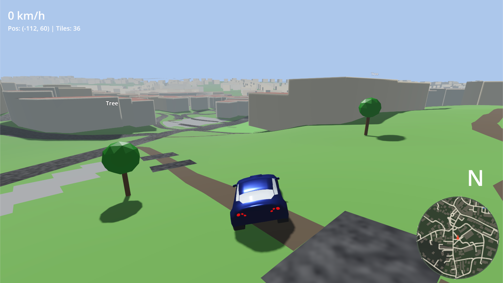

# OpenStreetMap Racer

A Godot 4 driving game that dynamically renders OpenStreetMap data as 3D environments.



## How It Works

### Architecture

1. **OSM Parser** (`scripts/osm_parser.gd`) — Parses `.osm` XML files into structured data (nodes, ways, relations). Converts lat/lon to local meter-based coordinates using equirectangular projection.

2. **Tile Manager** (`scripts/osm_tile_manager.gd`) — Divides the world into a grid of tiles (default 200m × 200m). As the camera moves, nearby tiles are loaded and distant ones are unloaded. The OSM file is parsed once at startup into an in-memory spatial index.

3. **Way Builder** (`scripts/osm_way_builder.gd`) — Generates terrain-draped ribbon meshes for linear ways: roads (`highway=*`, width/color by type — motorway, primary, residential, footway, etc.), waterways (`waterway=*`) as blue ribbons, and railways (`railway=rail|tram|light_rail|…`) as a ballast bed with two steel rail strips.

4. **Infrastructure Builder** (`scripts/osm_infrastructure_builder.gd`) — Builds elevated structures that ride above the ground rather than draping onto it: overhead power lines (`power=line|minor_line|cable`) as drooping catenary cables strung between towers/poles, and sign gantries (`man_made=gantry`) as a raised cross-beam on support legs.

5. **Building Builder** (`scripts/osm_building_builder.gd`) — Extrudes 3D buildings from OSM way outlines tagged with `building=*`. Height is determined from `height`, `building:levels` tags, or a default. Supports `roof:shape` with 12 roof types (flat, gabled, hipped, pyramidal, skillion, half-hipped, gambrel, mansard, round, dome, onion, saltbox, sawtooth) plus `roof:height`, `roof:colour`, `roof:levels`, and `roof:orientation` tags.

6. **Asset Placer** (`scripts/osm_asset_placer.gd`) — Places colored placeholder boxes for point features (nodes with tags): traffic lights (green box), trees (green box), benches (brown box), street lamps (yellow pole), bus stops (blue box), etc. **Edit the `ASSET_DEFS` dictionary to add more asset types.**

7. **Relation Builder** (`scripts/osm_relation_builder.gd`) — Handles OSM relations, primarily `type=multipolygon` for complex buildings and land areas.

8. **Car Controller** (`scripts/car_controller.gd`) — Simple WASD driving controller.

9. **Height Provider** (`scripts/height_provider.gd`) — Samples terrain elevation from a pre-baked DEM heightmap (Copernicus GLO-30 or NASA SRTM). When present, OSM nodes are lifted onto the terrain and the ground becomes a displaced mesh. Degrades to a flat world when no DEM is baked.

10. **Sky Controller** (`scripts/sky_controller.gd`) — Owns the sky and key lighting, and blends between a **day** and a **night** preset on demand. A procedural sky shader (`scripts/shaders/sky.gdshader`) renders a gradient dome, a sun disk with atmospheric glow, and drifting fractal-noise clouds. The controller keeps the sky shader, the `DirectionalLight3D` (sun/moon), and the environment's fog and ambient light in agreement, and animates a smooth crossfade when toggled. Edit the `DAY` and `NIGHT` dictionaries to retune either palette.

11. **Headlights** (`scripts/headlights.gd`) — A self-contained component under the car holding two forward-facing `SpotLight3D` beams and the glowing lamp faces. It exposes a single `set_on(bool)` intent and fades the beams + lamp emission up/down like real bulbs. `main.gd` (the composition root) connects the sky controller's `day_night_changed` signal to it, so the headlights **switch on automatically after dark and off by day** — the car owns the lights, the sky controller decides when it's dark, and neither knows about the other.

### Dynamic Loading

The tile manager tracks which tile the camera is in. When the camera crosses into a new tile, it:
- Loads all tiles within `load_radius` (default: 2 tiles in each direction)
- Unloads tiles beyond `unload_radius` (default: 3 tiles)
- Each tile gets a ground plane, roads, buildings, assets, and relation geometry

### Coordinate System

- OSM lat/lon is projected to local meters using the dataset center as origin
- X = East, Z = South (negated latitude), Y = Up
- 1 unit = 1 meter
- Y (elevation) is 0 unless a DEM heightmap is baked (see *Terrain Elevation* below)

## Setup

### Getting Map Data

1. Go to [openstreetmap.org/export](https://www.openstreetmap.org/export)
2. Select your area of interest (keep it reasonable — a few km² works well)
3. Click "Export" to download a `.osm` file
4. Place the file at `data/map.osm`

Alternatively, use [JOSM](https://josm.openstreetmap.de/) for larger exports, or the Overpass API:
```
https://overpass-api.de/api/map?bbox=8.46,49.48,8.48,49.49
```

### Terrain Elevation (optional)

By default the world is flat (Y = 0). To render real terrain, bake a Digital
Elevation Model (DEM) into a heightmap with `tools/bake_dem.py`. The game loads
it at startup, lifts OSM nodes onto the terrain, and replaces the flat ground
with a displaced mesh (with a matching collider, so the car drives on the
relief). No DEM = flat world, so this step is entirely optional.

**Choosing a source:**

| | Copernicus GLO-30 (recommended) | NASA SRTM |
|---|---|---|
| Resolution | 30 m, global, void-filled | 30 m (US) / 90 m (global, 60°N–56°S) |
| Access | AWS Open Data, no auth | NASA Earthdata login or mirrors |
| License | Free / permissive | Public domain |

**Workflow:**

1. Ask the baker which Copernicus tiles your map needs. It reads the bounds from
   `data/map.osm` and prints the exact S3 URIs plus ready-to-run download and
   bake commands (a bbox may span several 1°×1° tiles):
   ```sh
   uv run tools/bake_dem.py --list-tiles
   ```

2. Download the listed tile(s). Copernicus needs no credentials — copy the
   `aws s3 cp` line(s) printed by step 1, e.g.:
   ```sh
   aws s3 cp --no-sign-request \
     s3://copernicus-dem-30m/Copernicus_DSM_COG_10_N50_00_E007_00_DEM/Copernicus_DSM_COG_10_N50_00_E007_00_DEM.tif \
     Copernicus_DSM_COG_10_N50_00_E007_00_DEM.tif
   ```

3. Bake it with [uv](https://docs.astral.sh/uv/) (bounds are auto-detected from
   `data/map.osm`). The script declares its dependencies inline (PEP 723), so
   `uv run` installs them automatically on first use — no venv or `pip install`:
   ```sh
   uv run tools/bake_dem.py --dem Copernicus_DSM_COG_10_N50_00_E007_00_DEM.tif --source "Copernicus GLO-30"
   ```
   Pass `--dem` multiple times to mosaic several tiles. This writes
   `data/map.dem.png` (16-bit heightmap) and `data/map.dem.json` (geographic +
   elevation metadata the game uses to decode it).

4. Run the game — terrain appears automatically. Delete the two `data/map.dem.*`
   files to go back to flat.

Tune `terrain_subdivisions` on the tile manager (default 16) to trade vertex
count for slope smoothness.

### Running

1. Open this project in Godot 4.6+
2. Ensure `data/map.osm` exists with your desired map data
3. Press F5 to run

### Controls

- **W / S** — Accelerate / Brake
- **A / D** — Steer left / right
- **Escape** — Pause / resume (frees the mouse for the menu)

The pause menu has a **Day / Night** toggle that crossfades the sky, sun, clouds,
fog and shadows between the two presets. The car's **headlights turn on and off
automatically** with the time of day — no manual control needed.

## Testing

Unit tests live in `tests/` and run on [gdUnit4](https://github.com/MikeSchulze/gdUnit4)
(vendored in `addons/gdUnit4/`). Each suite extends `GdUnitTestSuite`; the
command-line runner exits with a non-zero code on failure, making it CI-friendly.

Run the whole suite (set `GODOT` if `godot` isn't on your `PATH`):

```sh
tests/run_tests.sh
```

That wraps the gdUnit4 command-line runner:

```sh
godot --headless --path . \
  -s addons/gdUnit4/bin/GdUnitCmdTool.gd \
  --ignoreHeadlessMode \
  -a tests
```

Pass a single file to `-a` (e.g. `-a tests/test_polygon_utils.gd`) to run one
suite. gdUnit4 writes XML/HTML results under `reports/` (gitignored).

`test_polygon_utils.gd` pins the winding-order logic in `PolygonUtils` — the
CW/CCW normalization OSM data depends on — so refactors can't silently invert
faces or break orientation handling.

## Customization

### Adding New Placeholder Assets

Edit `ASSET_DEFS` in `scripts/osm_asset_placer.gd`. Each entry maps an OSM tag key + value to a placeholder definition:

```gdscript
"highway": {
    "traffic_signals": {
        "color": Color(0.1, 0.7, 0.1),
        "size": Vector3(0.3, 3.0, 0.3),
        "y_offset": 1.5,
        "label": "Traffic Light"
    },
}
```

Use `"*"` as the value to match any value for a given tag key.

### Tile Settings

In the scene inspector or in `osm_tile_manager.gd`:
- `tile_size` — Size of each tile in meters (default: 200)
- `load_radius` — How many tiles to keep loaded around camera (default: 2)
- `unload_radius` — Distance at which tiles are freed (default: 3)

### Sky & Day/Night

The look of each time of day lives in the `DAY` and `NIGHT` constant
dictionaries in `scripts/sky_controller.gd` — sky gradient colours, sun/moon
angle and brightness, cloud tint and coverage, fog, and ambient light. Tune a
field there and both the sky shader and the scene lighting follow it.

Cloud shape and motion are driven by the `sky.gdshader` uniforms (set on the
`ShaderMaterial` in `main.tscn`): `cloud_scale`, `cloud_softness` and
`cloud_wind` control puff size, edge sharpness and drift speed.

The scene starts in daytime; flip `start_in_day` on the `SkyController` node to
start at night.

The car's headlights live under `Car/Headlights` in `main.tscn` (two
`SpotLight3D` beams + two emissive lamp boxes). Tune `beam_energy` and
`lamp_glow_energy` on the `Headlights` node for brightness, or adjust each
`SpotLight3D`'s `spot_range` / `spot_angle` for beam reach and spread. They are
driven entirely by the day/night state — no manual toggle.

### Scaling Up

For larger maps, consider:
- A **PostGIS** database with `osm2pgsql` imported data, queried via GDScript HTTP or GDExtension
- The **Overpass API** for on-the-fly tile fetching
- Streaming from **`.osm.pbf`** files with a custom C++ GDExtension

The current `.osm` file approach works well for areas up to ~10 km².
